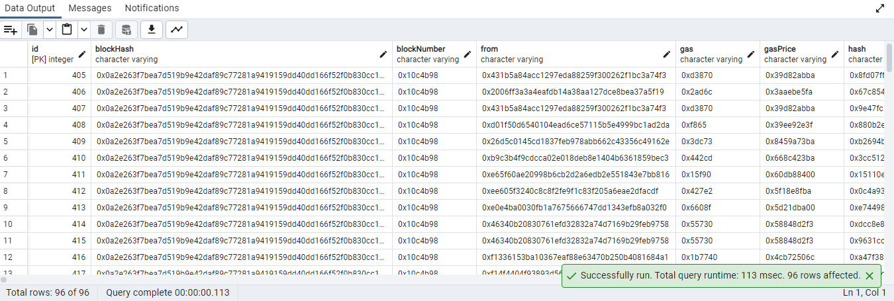
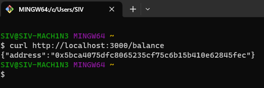

# Fintech app

1. Установите зависимости командой `npm i`
2. Скопируйте содержимое файла `.env.example` в `.env`, заполните данные
- Порт веб-сервера (по умолчанию 3000)
- Данные БД PostgreSQL
3. Запуск в режиме разработки (при каждом обновлении кода сервер автоматически перезапускается) - `npm run dev`
4. Запуск в режиме продакшн: `npm run build`, `npm run start`

- Cron-job сервис в фоновом режиме сохраняет в Postgres информацию о транзакциях во всех блоках, начиная с 17583000 (в режиме реального времени, частота - раз в минуту).

 
 

- Эндпоинт `/balance` выдаст адрес, баланс которого изменился больше остальных (по абсолютной величине) за последние 100 блоков.

